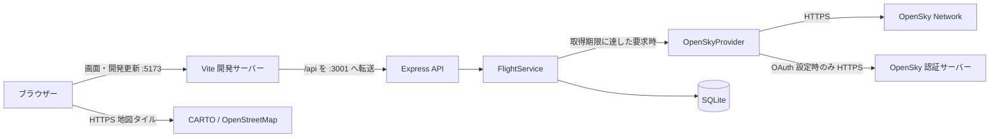
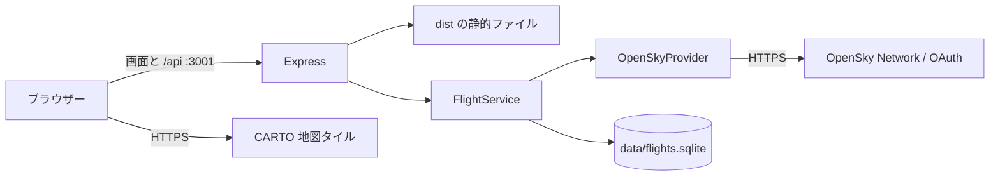
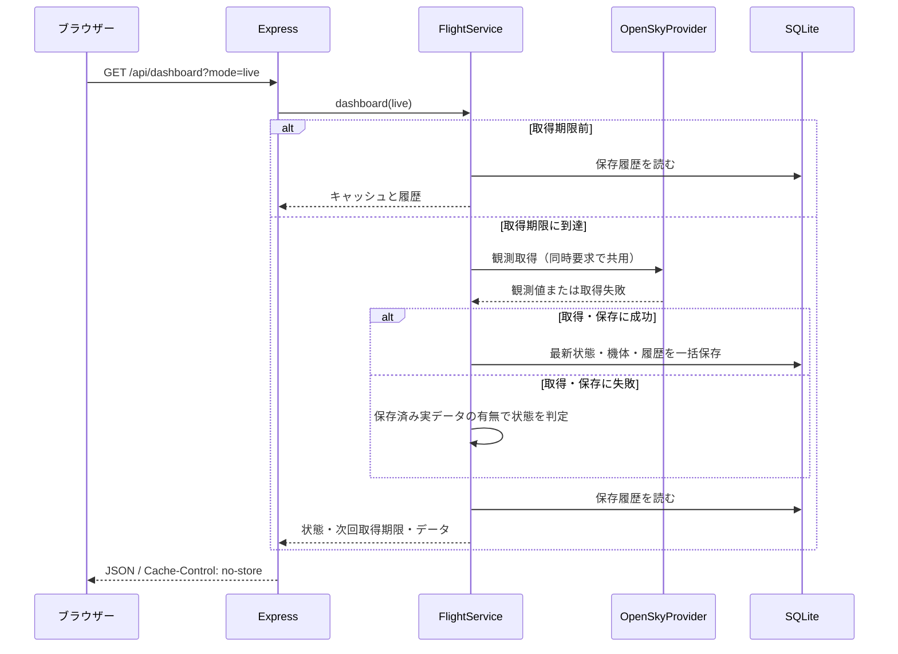

# 基本設計・システム構成

この文書は、同梱されている実装の構成と動作を説明します。機能の目的・要件は [企画書](01-project-proposal.md) と [要件定義書](02-requirements.md)、保存形式は [データベース設計書](05-database-design.md)、HTTP の契約は [API 仕様書](06-api-specification.md) を参照してください。

## 1. システムの目的と取得範囲

SKYTRACE は、OpenSky Network が観測した航空機のうち、最近通信があった飛行中の機体を集計し、地図・一覧・詳細・機数の履歴として表示します。OpenSky の受信範囲、機体からの送信、API の利用枠に依存するため、世界中の全航空機を網羅する正確な総数ではありません。

出発・到着空港、機種、機体登録記号、旅客数、運航会社の確定情報は現在のデータモデルにありません。`callsign` はコールサイン、`originCountry` は登録国です。登録国を、機体が現在飛んでいる国として解釈しません。

## 2. 採用技術

| 層 | 技術 | 役割 |
| --- | --- | --- |
| 実行環境 | Node.js 24.5.0 以上 / npm | API の実行、パッケージ管理、標準 SQLite と環境プロキシ対応 |
| フロントエンド | React 19 / TypeScript | 日本語のダッシュボード、状態管理、型の共有 |
| 開発・ビルド | Vite 7 / `tsx` | 開発サーバー、画面のビルド、サーバー側 TypeScript の実行 |
| HTTP API | Express 5 | API のルーティング、本番ビルドの静的配信 |
| 地図 | Leaflet 1.9 / React Leaflet 5 | 地図操作、機体マーカー、位置への移動 |
| 地図背景 | CARTO / OpenStreetMap | ブラウザーから地図タイルを取得 |
| 背景の代替 | 同梱の Natural Earth 陸地データ | タイル障害時にも簡易背景を表示 |
| データベース | Node.js 標準 `node:sqlite` / SQLite | 最新観測と機数履歴をローカルファイルに保存 |
| 検証 | Node.js テストランナー / Playwright | バックエンドの検証とブラウザー操作の検証 |

実際にインストールするバージョンは `package-lock.json` で固定します。SQLite 用の外部 DB サーバーやネイティブ npm ドライバーの導入は不要です。

## 3. 開発時の構成

`npm run dev` は API と Vite を同時に起動します。ブラウザーは Vite のポート 5173 に接続し、`/api` のリクエストを Vite が API のポート 3001 に転送します。

Vite のポートは `strictPort: true` のため、5173 が使用中なら別ポートへ自動移動せず起動に失敗します。Vite の API 転送先は現在 `127.0.0.1:3001` に固定されているため、通常の開発では API の `PORT` を 3001 にします。

## 4. 本番ビルドを使う構成

`npm run build` は型チェック後に画面を `dist/` へ出力します。続いて `npm start` を実行すると、Express が画面と API の両方を標準ポート 3001 で配信します。

サーバーの TypeScript は本番起動時も `tsx` で実行します。現在 `tsx` は `devDependencies` に含まれているため、この構成をそのまま動かす際は `npm ci --omit=dev` で省略せず、`npm ci` で導入します。`dist/index.html` がなければ API は動きますが画面の静的配信は有効になりません。

公開用 HTTPS の終端、ドメイン、外部への公開設定、プロセス監視はこのアプリの起動処理には含まれません。現在の構成はローカル開発または単一サーバープロセスでの実行を対象とします。

## 5. ソースの責務

| ファイル・ディレクトリ | 責務 |
| --- | --- |
| `src/App.tsx` | API の定期確認、統計、地図、検索、並べ替え、一覧、詳細、履歴グラフ |
| `src/styles.css` | デスクトップ・スマートフォン向け表示 |
| `src/components/world-land.ts` | 同梱する簡易地図の陸地データ |
| `src/main.tsx` | React の起動 |
| `server/index.ts` | `.env` 読み込み、DB・サービスの生成、HTTP 待ち受け、終了処理 |
| `server/app.ts` | 入力チェック、API 応答、エラー応答、静的ファイル配信 |
| `server/service.ts` | モード切り替え、共有キャッシュ、取得期限、状態判定、保存との連携 |
| `server/opensky.ts` | 外部 API、OAuth、制限・タイムアウト対処、状態ベクトルの検証と変換 |
| `server/demo.ts` | 架空の機体と履歴を生成 |
| `server/database.ts` | SQLite スキーマ、移行、トランザクション、履歴の保存期間 |
| `server/init-db.ts` | DB だけを初期化するコマンド |
| `shared/types.ts` | フロントエンドとバックエンドが共有する API 型 |
| `tests/` | バックエンド・ブラウザーテスト |

現在の画面はダッシュボード応答に含まれる機体から詳細を表示します。詳細取得 API も提供しますが、画面の機体選択ごとに追加の詳細 API 通信を行う構成ではありません。

## 6. 観測を取得する流れ

外部取得は、ダッシュボードまたは詳細 API への要求が来て、取得期限に達している場合に実行します。サーバー起動だけで継続取得するバックグラウンドジョブはありません。画面を閉じて誰も要求しなければ、その間の実測履歴は新しく保存されません。

同一プロセス内でライブ取得中に届いた要求は、同じ `Promise` の完了を待ちます。複数閲覧者や画面の更新ボタンが同時に動いても、そのプロセスの外部取得をまとめて処理します。この共有はプロセス内だけです。複数プロセスや複数サーバー間で取得期限を同期する Redis・分散ロックは実装していません。

## 7. 更新間隔と鮮度

| 対象 | 標準間隔 | 補足 |
| --- | --- | --- |
| 匿名 OpenSky 取得 | 900 秒 | サーバーが期限を管理 |
| OAuth OpenSky 取得 | 120 秒 | ID とシークレットの両方を設定した場合 |
| ライブ画面のローカル API 確認 | 通常 30 秒 | 成功後は `max(5, min(30, pollIntervalSeconds))` 秒 |
| デモの生成・画面確認 | 10 秒 | 外部 API を使用しない |
| 画面からローカル API へ接続失敗後 | ライブ 60 秒 / デモ 10 秒 | 画面側の再試行間隔 |

`POLL_INTERVAL_SECONDS` は 10〜86,400 の有限数を受け付け、小数は切り上げます。未指定なら認証情報の有無から標準値を選びます。匿名の全世界取得は 1 回につき 4 クレジット、標準の匿名日次枠は 400 クレジット / IP です。900 秒で継続取得すると最大 96 回 / 日となります。OAuth の標準日次枠は 4,000 クレジットですが、実際の枠・共有 IP の利用・提供側の変更に依存します。利用前に [OpenSky の公式仕様](https://openskynetwork.github.io/opensky-api/rest.html) を確認してください。

「ライブ」は、新しい取得に成功し、観測時刻からの経過が 120 秒以内である状態です。120 秒を超えると、取得期限前でも「古いデータ」の表示になります。匿名 900 秒設定では、正常運転中も次回取得まで古いデータを表示する時間が生じます。画面の時計を 1 秒ごとに更新しても、機体の位置を毎秒新規取得したり、未観測の位置を補間したりする処理はありません。

## 8. 取得値の検証と集計

1. 応答の観測時刻と `states` の形を確認します。`states: null` と空配列は正当な 0 件として扱います。
2. ICAO24 が 6 桁の 16 進数、`on_ground` が真偽値、最終通信時刻が有効な行を採用します。
3. 最終通信が観測時刻より 120 秒を超えて古い行、30 秒を超えて未来の行を除外します。
4. ICAO24 は小文字へ統一し、重複時は最終通信が新しい状態を残します。
5. 地上の機体を詳細一覧から除外します。`totalObserved` は、この除外前の有効な機体数です。
6. 位置が有効範囲かつ位置時刻が新しい場合だけ緯度・経度を採用します。位置がなくても飛行中の集計には含めます。
7. 高度は幾何高度を優先し、欠損時は気圧高度を使います。範囲外・欠損の値は `null` にします。

サーバーが受け入れる観測時刻にも、現在時刻に対して過去 120 秒 / 未来 30 秒の上限があります。各数値の範囲・単位は [API 仕様書](06-api-specification.md) に記載します。

地図は位置を持つ検索対象を最大 1,200 機に間引き、選択中の機体をその範囲に含めます。集計・検索・一覧の対象機数を 1,200 機に切り詰める処理ではありません。一覧は 1 ページ 8 件で、検索・並べ替え・ページ処理はブラウザー内で行います。API のサーバー側ページ分割はありません。

## 9. 障害と再起動

| 状況 | 動作 |
| --- | --- |
| 外部取得失敗・保存済み実データあり | `status: stale` と最後の実データを返す |
| 外部取得失敗・保存済み実データなし | `status: unavailable`、空の機体一覧、取得時刻 `null` を返す |
| 保存失敗 | トランザクションを戻し、前回データを維持する |
| HTTP 429 | 返却ヘッダーから待機時間を取得し、次回まで外部取得を控える |
| OAuth 利用中の HTTP 401 | キャッシュ済みトークンを破棄し、一度再取得して要求を再送する |
| 再送後も 401 / 403 | エラーを表示し、再試行期限まで待つ |
| 地図タイル障害 | 同梱の簡易背景を表示する |
| API プロセス再起動 | DB の最新状態を読み出し、保存取得時刻と現在の設定から次回期限を復元する |

外部 HTTP 要求ごとのタイムアウトは 8 秒です。OAuth トークン取得と観測取得が連続する場合、処理全体の時間は 8 秒を超える可能性があります。ブラウザーのローカル API 要求タイムアウトは 10 秒です。

失敗後のサーバー取得待機は `max(設定取得間隔, 失敗種別の待機秒数)` です。429 の待機ヘッダーは 60〜86,400 秒に調整し、ヘッダーが不明なら 900 秒を使います。OAuth 不備・認証拒否・アクセス拒否は通常 300 秒、一般の接続・形式エラーは通常 60 秒を下限とします。

再起動時は、保存状態を最初は `stale` として扱います。正常取得の期限は DB の `fetched_at` から復元しますが、失敗の追加待機・429 制限・OAuth トークンはメモリーに保持するため再起動で失われます。再起動によって API 制限が解除されることを保証する構成ではありません。

## 10. 設定と接続先

| 設定 | 標準値・用途 |
| --- | --- |
| `PORT` | `3001`。1〜65,535 の整数 |
| `HOST` | 未設定なら `0.0.0.0`。`.env.example` ではローカル利用向けに `127.0.0.1` |
| `DATABASE_PATH` | `data/flights.sqlite`。DB ファイルの保存先 |
| `OPENSKY_CLIENT_ID` | 任意。OAuth API クライアント ID |
| `OPENSKY_CLIENT_SECRET` | 任意。OAuth API クライアントのシークレット |
| `POLL_INTERVAL_SECONDS` | 任意。ライブ取得間隔の変更 |

`.env` はサーバー起動時に読み込みます。`VITE_` 接頭辞へ秘密の値を入れたり、ブラウザーへ OAuth 情報を返したりしません。ブラウザーには、ヘルス API の「認証情報の両方が設定されているか」という真偽値だけが返ります。この値は認証成功の保証ではありません。

| 接続先 | 接続する側 | 用途 |
| --- | --- | --- |
| `registry.npmjs.org` | 開発・セットアップ環境 | npm パッケージ導入 |
| `opensky-network.org` | API サーバー | 全世界の状態ベクトル取得 |
| `auth.opensky-network.org` | API サーバー | OAuth 設定時のトークン取得 |
| `basemaps.cartocdn.com` | ブラウザー | 地図タイル取得 |

`dev:server` と `start` は Node.js の `--use-env-proxy` を有効にします。HTTPS プロキシが必要な環境でも TLS 証明書の検証を維持します。証明書検証を無効にする設定は使用しません。

## 11. 現在の運用範囲

API を読む利用者のログイン・権限制御、分散キャッシュ、定期バックグラウンド収集、機体ごとの航跡保存、リアルタイム WebSocket 配信、デプロイの自動化は現在の実装範囲に含まれません。公開運用でこれらが必要な場合は、追加要件として設計・実装します。OpenSky データの利用条件と地図の帰属表示は公開時にも確認し、帰属表示を維持してください。

## 12. 実装・公式資料

- 実装: [API 起動処理](../server/index.ts)、[ルーティング](../server/app.ts)、[サービス](../server/service.ts)、[OpenSky 連携](../server/opensky.ts)、[画面](../src/App.tsx)、[Vite 設定](../vite.config.ts)
- [OpenSky REST API 公式仕様](https://openskynetwork.github.io/opensky-api/rest.html)
- [Node.js SQLite 公式資料](https://nodejs.org/api/sqlite.html)
- [Node.js CLI 公式資料](https://nodejs.org/api/cli.html)
- [Natural Earth データ利用条件](https://www.naturalearthdata.com/about/terms-of-use/)

[ドキュメント一覧へ戻る](README.md)
