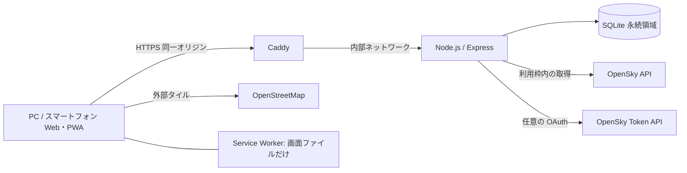
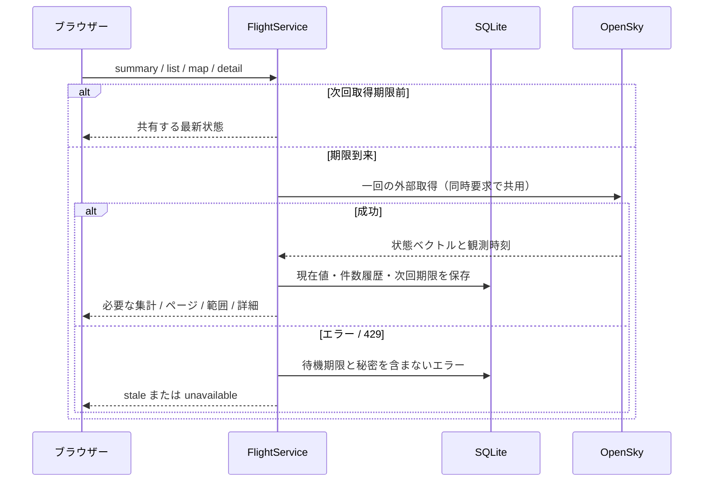

# システム設計書

## 1. 構成

単一サーバーでビルド済み画面と API を同一オリジンから配信する。SQLite の永続領域を使い、公開時は Caddy を HTTPS リバースプロキシとする。開発時だけ Vite が API 3001 に転送する。直接起動の標準 HOST は 127.0.0.1、Docker は内部ネットワーク用の 0.0.0.0 を明示する。

この図の構成は設定例であり、実ドメインへ公開済みという意味ではない。公開先、OAuth クライアント、運用規模は未確定。

## 2. 責務

| 場所 | 責務 |
| --- | --- |
| `src/` | 画面、データ要求、検索状態、鮮度、レスポンシブ、Canvas 地図 |
| `public/` とビルド補助 | manifest / アイコン / Service Worker、画面だけのキャッシュ |
| `shared/types.ts` | 集計・ページ一覧・地図・詳細の共通 API 型 |
| `server/query.ts` | 許可クエリ、型、長さ、上限、範囲の検証 |
| `server/app.ts` | ルーティング、静的ファイル、エラー、安全な応答 |
| `server/security.ts` | Helmet、CSP、API 制限、圧縮、キャッシュ / プロキシ設定 |
| `server/service.ts` | モード別キャッシュ、同時取得の共用、更新期限、バックグラウンド更新 |
| `server/opensky.ts` | OAuth と状態ベクトル取得、解析、429 / 401 とタイムアウト |
| `server/database.ts` | SQLite v2 移行、現在値、履歴、取得期限の保存 |
| `Dockerfile` / `compose.yml` / `Caddyfile` | ビルド済み実行、非 root、永続領域、HTTPS 例 |
| `.github/` | CI、依存更新、Issue / PR の記録 |

## 3. 通信量の削減

旧 `/api/dashboard` は全機体を返す互換 API として維持する。新画面は機体を含まない `/summary`、標準 8 件の `/flights`、範囲内の軽量位置だけの `/map`、一機の `/flights/:icao24` を利用する。全体集計と検索結果 / 地図対象数を区別する。

地図は遅延 import、Canvas 描画。UI 標準上限はスマートフォン 200 / PC 600、API 上限 1,000。API は gzip と ETag に対応し、Cache-Control は private / 再検証。画面は正確な URL ごとのメモリーキャッシュを最大 30 件に制限し、手動で ETag を再検証する。非表示 / オフラインではポーリングを止め、復帰すると確認する。Service Worker の観測キャッシュは利用しない。

ビルドには gzip のサイズ予算を含める。初期 JS 120 KiB、全 JS 300 KiB、CSS 40 KiB が上限。静的 import の初期グラフに地図 vendor が含まれないことも確認する。これは通信 / コードの予算で、実端末の応答時間や大量の同時アクセスの保証ではない。

## 4. データ取得と期限

匿名標準 900 秒 / OAuth 標準 120 秒。更新ボタンも期限を守る。ブラウザーはローカル API の状態を確認するが、それが毎回外部 API を呼ぶ意味ではない。期限・失敗待機を `provider_state` に保存するため、スナップショットがない場合も再起動で待機を解除しない。

本番は `BACKGROUND_REFRESH=true` を標準とし、閲覧者がいない間もライブの期限を管理する。開発は明示的な設定で有効化できる。同時の要求と背景取得で外部取得を重複させない。停止は背景処理を停止し、実行中の取得を待って DB を閉じる。

## 5. データ品質と状態

OpenSky の通信時刻、位置時刻、範囲、測定値を検証し、飛行中の重複機体を最新通信で一意にする。地図は有効な位置だけ、機数と一覧は位置欠損も含む。正常な空観測は 0、不正応答 / 失敗は unavailable または stale。

観測時刻から 120 秒を超えると古い状態。実データとデモの DB / キャッシュ / 履歴を分離する。保存済みより古い観測は拒否する。デモは明示的な選択だけで、ライブ失敗の代用にしない。

## 6. OAuth と外部 API

サーバーが `client_credentials` でトークンを取得し、期限付きでメモリー内に保持する。認証拒否時は一度更新し、無限に再試行しない。トークン、ID、secret を API 応答に含めない。外部通信はタイムアウト付き。Node.js の `--use-env-proxy` で環境の HTTPS プロキシに対応し、TLS の検証を維持する。

`OPENSKY_CLIENT_ID` と `OPENSKY_CLIENT_SECRET` は対で指定。実クライアントは未用意なので、認証処理のモック確認と実 OAuth の成功を区別する。取得枠と利用条件は公開時に確認する。

## 7. PWA とオフライン

manifest とアイコンを配信し、ビルド後の同一オリジンの画面基本ファイルを Service Worker に登録する。API URL、外部タイル、他オリジンをキャッシュしない。オフライン起動では画面を利用できても、現在の機数は取得できないことを案内する。ページが開いたままの最後の観測は通信状態 / 鮮度と合わせて扱う。

HTTPS（開発 localhost を除く）が必要。OS / ブラウザーによりインストール操作が異なる。アプリ更新時のキャッシュ切替も公開先で確認する。

## 8. 公開と安全性

Helmet / CSP、読み取り API の IP 制限、クエリの厳格検証、パラメーター化した SQL を用いる。CSP は同一オリジンの script を許可し、Leaflet の動的配置用 style の `unsafe-inline` は許容する。直接起動で転送ヘッダーを信用せず、Caddy の内部経路では構成に合わせた 1 段を信頼する。

本番ビルドはサーバーを `dist-server/` へコンパイルし、`npm start` は JavaScript を Node.js で起動する。実行時は開発依存を除外可能。API の Docker コンテナーは非 root、API ポートは Compose 内だけ、DB は永続領域。Caddy のドメインと証明書発行用メールは利用者が指定する。

## 9. 制約

SQLite とメモリーの API 制限は単一インスタンスを前提とする。多台数化には取得ジョブと制限 / DB の共有設計が必要。CSP やレート制限だけで DDoS を防げるとは扱わない。公開先の監視・ログ・容量・復旧・負荷の検証を別に行う。

[DB 設計](05-database-design.md) · [API 仕様](06-api-specification.md) · [運用手順](11-operations.md) · [資料一覧](README.md)
