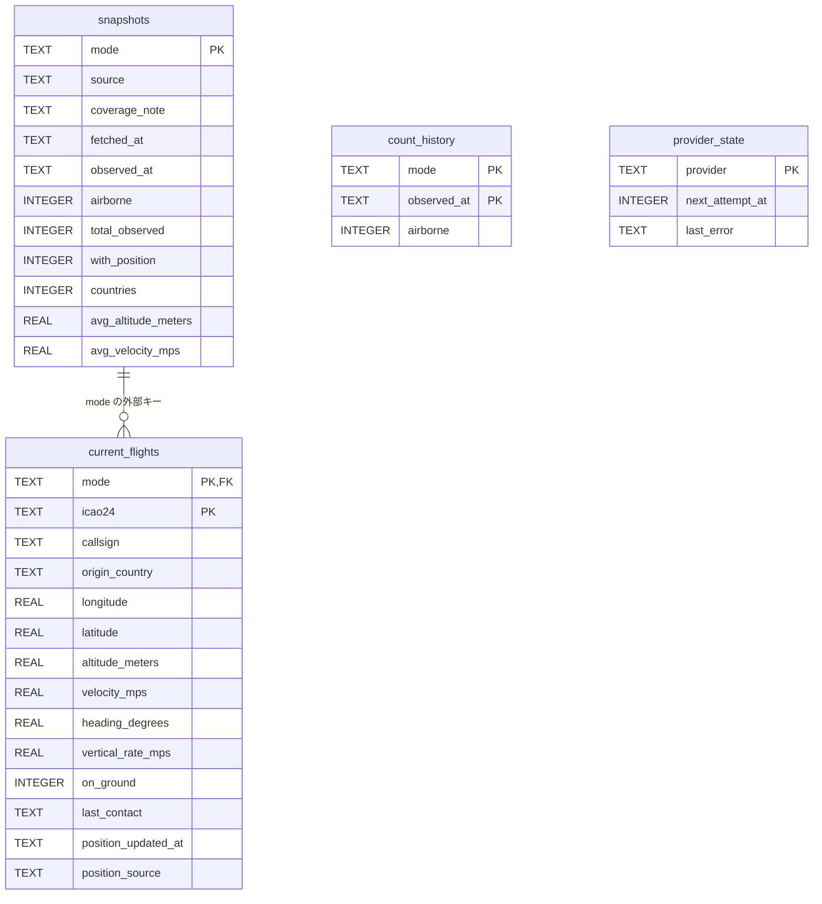

# データベース設計書

この文書は [server/database.ts](../server/database.ts) に実装されている SQLite スキーマと保存処理を説明します。スキーマのバージョンは `PRAGMA user_version = 2` です。v1 の観測テーブルを保持して取得期限のテーブルを追加します。

## 1. 保存方式と初期化

| 項目 | 内容 |
| --- | --- |
| DB エンジン | SQLite、Node.js 標準 `DatabaseSync` |
| 標準ファイル | `data/flights.sqlite` |
| 保存先の変更 | サーバー環境変数 `DATABASE_PATH` |
| 初期化 | `npm run db:init` または API 起動時に自動実行 |
| DB サーバー | 別途用意する必要なし |
| ジャーナル | ファイル DB では WAL |
| 外部キー | `PRAGMA foreign_keys = ON` |
| ロック待機 | `PRAGMA busy_timeout = 5000`（5 秒） |
| 時刻 | UTC の ISO 8601 文字列。例: `2026-10-08T00:00:00.000Z` |
| Git | `data/` 全体を対象外とする |

ファイルの親ディレクトリがなければ作成します。初期化は観測データの取得やデモ機体の登録を行いません。繰り返し初期化しても v2 の既存 DB はそのまま使用します。v1 はトランザクションで `provider_state` を追加して v2 へ移行し、観測・機体・履歴を保持します。v2 より新しい DB は誤操作を避けるため起動に失敗します。移行前にバックアップを取得し、v2 移行後に旧 v1 のアプリへ直接戻さないでください。

テストでは `:memory:` を使えます。この場合はファイル作成と WAL 設定を行いません。テーブルは `STRICT` 指定ではありません。数値・日付形式・識別子形式の検証は主にアプリケーション側で行います。

## 2. テーブル全体

| テーブル | 保存内容 | 上限・更新方式 |
| --- | --- | --- |
| `snapshots` | 最新の取得時刻・観測時刻・統計 | `live` / `demo` 各 1 行 |
| `current_flights` | 最新スナップショットの飛行中の機体 | 対象モードを一括置換 |
| `count_history` | 観測時刻ごとの飛行中の機数 | モードごとに保存時の直近 24 時間 / 最大 1,440 点 |
| `provider_state` | OpenSky の次回取得期限と失敗の説明 | プロバイダーごとに 1 行。スナップショットがなくても保存 |

ライブとデモの観測用 3 テーブルは主キーに `mode` を含め、別のレコードとして保存します。`provider_state` は実データの外部取得専用で、デモの期限とは共用しません。同じ ICAO24 が両方のモードにあっても別レコードです。履歴に保存するのは機数であり、過去の機体位置や機体ごとの航跡ではありません。



`count_history.mode` には `snapshots` への外部キーを設定していません。デモ履歴をスナップショットより先に生成できる構造です。ER 図の線は、実装に存在する `current_flights.mode` の外部キーだけを示します。

## 3. snapshots

| カラム | SQLite 型 | NULL | 制約・意味 |
| --- | --- | --- | --- |
| `mode` | TEXT | SQL に `NOT NULL` 明記なし※ | 主キー。`CHECK (mode IN ('live', 'demo'))` |
| `source` | TEXT | 不可 | データ提供元 |
| `coverage_note` | TEXT | 不可 | 受信範囲・集計対象の説明 |
| `fetched_at` | TEXT | 不可 | サーバーが正常取得・保存した時刻、UTC |
| `observed_at` | TEXT | 不可 | データ提供側の観測時刻、UTC |
| `airborne` | INTEGER | 不可 | 飛行中の機数 |
| `total_observed` | INTEGER | 不可 | 地上を含む、最近通信がある有効機体数 |
| `with_position` | INTEGER | 不可 | 飛行中のうち有効な位置を持つ機数 |
| `countries` | INTEGER | 不可 | 飛行中機体の登録国の種類数。`Unknown` は除外 |
| `avg_altitude_meters` | REAL | 可 | 高度が取得できた飛行中機体だけの平均、m |
| `avg_velocity_mps` | REAL | 可 | 速度が取得できた飛行中機体だけの平均、m/s |

※ 通常の SQLite の TEXT 主キーでは、`PRIMARY KEY` だけで `NOT NULL` が強制されるとは限りません。現行 SQL は `mode` に `NOT NULL` を明記していませんが、アプリは `DataMode` 型の `live` / `demo` だけを保存します。直接 SQL を実行する際には、この差異に注意してください。

取得前・取得不可の状態を、このテーブルへ NULL の取得時刻で保存することはありません。保存処理は `fetchedAt` と `observedAt` の存在をチェックします。API の未取得を示す `null` は、スナップショットがない場合にサービス層が作ります。

## 4. current_flights

| カラム | SQLite 型 | NULL | 制約・意味 |
| --- | --- | --- | --- |
| `mode` | TEXT | 不可 | 複合主キー。`snapshots(mode)` を参照、親削除時に連動削除 |
| `icao24` | TEXT | 不可 | 複合主キー。小文字の 6 桁 16 進識別子 |
| `callsign` | TEXT | 不可 | コールサイン。取得できなければ空文字 |
| `origin_country` | TEXT | 不可 | 登録国。取得できなければ `Unknown` |
| `longitude` | REAL | 可 | 経度、度。位置が古い・不正なら NULL |
| `latitude` | REAL | 可 | 緯度、度。位置が古い・不正なら NULL |
| `altitude_meters` | REAL | 可 | 高度、m。幾何高度優先、欠損時は気圧高度 |
| `velocity_mps` | REAL | 可 | 対地速度、m/s |
| `heading_degrees` | REAL | 可 | 真北を 0 度とする対地進行方向、0 以上 360 未満 |
| `vertical_rate_mps` | REAL | 可 | 垂直速度、m/s。正が上昇、負が下降 |
| `on_ground` | INTEGER | 不可 | アプリが真偽値を 0 / 1 に変換して保存 |
| `last_contact` | TEXT | 不可 | 最終通信時刻、UTC |
| `position_updated_at` | TEXT | 可 | 有効な位置の観測時刻、UTC |
| `position_source` | TEXT | 不可 | `ADS-B` / `ASTERIX` / `MLAT` / `FLARM` / `Unknown` / `Simulation` |

主キーは `(mode, icao24)` です。`icao24` の書式、緯度・経度の範囲、`on_ground` の 0 / 1 は SQL の CHECK 制約ではありません。OpenSky 連携・デモ生成・保存処理が値を整えます。現在の実データ保存対象は飛行中の機体だけなので、通常の保存レコードは `on_ground = 0` です。

取得元の位置が有効でないときは、緯度・経度・位置時刻をまとめて NULL にします。その機体は一覧と機数集計に残り、地図から外れます。NULL の測定値を 0 として保存・表示しません。画面の対地速度は保存値の m/s を 3.6 倍し、km/h へ変換します。

## 5. count_history

| カラム | SQLite 型 | NULL | 制約・意味 |
| --- | --- | --- | --- |
| `mode` | TEXT | 不可 | 複合主キー。`CHECK (mode IN ('live', 'demo'))` |
| `observed_at` | TEXT | 不可 | 複合主キー。観測時刻、UTC |
| `airborne` | INTEGER | 不可 | その観測時刻の飛行中の機数 |

主キーは `(mode, observed_at)` です。同じモード・観測時刻をもう一度保存すると、機数を上書きします。同じ観測をブラウザーが繰り返し読むだけでは履歴を追加しません。

インデックス `history_mode_time` を `(mode, observed_at DESC)` に作成します。履歴取得は新しい順に最大 360 点を選び、API に返す前に古い順へ並べ直します。

保存上限と API の返却上限は別です。例えば匿名の 900 秒間隔で連続取得できた場合、24 時間の履歴は約 96 点です。最大 1,440 点を必ず生成する意味ではありません。

## 6. 実装している SQL

以下は v2 のテーブル定義です。新規 DB は v1 の 3 テーブルを作成後、別トランザクションで取得期限のテーブルを追加します。通常はこの SQL を手動実行せず、`npm run db:init` またはサーバー起動で作成します。

```sql
CREATE TABLE snapshots (
  mode TEXT PRIMARY KEY CHECK (mode IN ('live', 'demo')),
  source TEXT NOT NULL,
  coverage_note TEXT NOT NULL,
  fetched_at TEXT NOT NULL,
  observed_at TEXT NOT NULL,
  airborne INTEGER NOT NULL,
  total_observed INTEGER NOT NULL,
  with_position INTEGER NOT NULL,
  countries INTEGER NOT NULL,
  avg_altitude_meters REAL,
  avg_velocity_mps REAL
);

CREATE TABLE current_flights (
  mode TEXT NOT NULL REFERENCES snapshots(mode) ON DELETE CASCADE,
  icao24 TEXT NOT NULL,
  callsign TEXT NOT NULL,
  origin_country TEXT NOT NULL,
  longitude REAL,
  latitude REAL,
  altitude_meters REAL,
  velocity_mps REAL,
  heading_degrees REAL,
  vertical_rate_mps REAL,
  on_ground INTEGER NOT NULL,
  last_contact TEXT NOT NULL,
  position_updated_at TEXT,
  position_source TEXT NOT NULL,
  PRIMARY KEY (mode, icao24)
);

CREATE TABLE count_history (
  mode TEXT NOT NULL CHECK (mode IN ('live', 'demo')),
  observed_at TEXT NOT NULL,
  airborne INTEGER NOT NULL,
  PRIMARY KEY (mode, observed_at)
);

CREATE INDEX history_mode_time
  ON count_history(mode, observed_at DESC);

CREATE TABLE provider_state (
  provider TEXT PRIMARY KEY CHECK (provider = 'opensky'),
  next_attempt_at INTEGER NOT NULL CHECK (next_attempt_at >= 0),
  last_error TEXT
);

PRAGMA user_version = 2;
```

## 7. 保存時の一貫性

通常の保存は `BEGIN IMMEDIATE` による 1 トランザクションで次の操作を行います。

1. 対象モードの `snapshots` を INSERT または UPDATE する。
2. 同じモードの `current_flights` を全削除する。
3. 最新の飛行中機体をすべて INSERT する。
4. `count_history` に観測時刻・機数を INSERT または UPDATE する。
5. 同じモードの古い履歴と上限超過分を削除する。
6. すべて成功したら COMMIT、失敗したら ROLLBACK する。

途中で重複主キー等のエラーが発生しても、前回のスナップショット・機体一覧・履歴を戻します。他方のモードのレコードは変更しません。スナップショットの行を UPSERT してから機体を置換するため、通常の更新は親行の削除を伴いません。

## 8. 履歴の保存期間とデモ

通常保存時に、今回の `observed_at` から 24 時間を超えて古い履歴を対象モードから削除します。さらに新しい 1,440 点だけを残します。削除は新しい観測を保存したときに行い、独立した定期削除ジョブはありません。アプリを止めたままにすると、ファイル内の履歴が時計の経過だけで削除されることはありません。

デモを開くと、画面確認用に約 2 時間分・120 点の架空の履歴を準備します。デモ履歴の初期投入は専用トランザクションで、スナップショット保存とは別に行います。既存履歴が十分新しい場合は重ねて投入しません。その後はデモの通常保存時に同じ保持ルールを適用します。

API が返す `history` はライブ・デモとも直近最大 360 点です。デモの履歴を実測履歴へコピーする処理はありません。

## 9. provider_state と再起動後の復元

| カラム | SQLite 型 | NULL | 制約・意味 |
| --- | --- | --- | --- |
| `provider` | TEXT | `NOT NULL` 明記なし | 主キー、`CHECK (provider = 'opensky')`。アプリは固定値だけ保存 |
| `next_attempt_at` | INTEGER | 不可 | Unix 時刻のミリ秒。0 以上。次に外部取得を試せる期限 |
| `last_error` | TEXT | 可 | 表示用の失敗の説明。成功時は NULL。OAuth 資格情報やトークンは保存しない |

外部取得の開始、成功、失敗 / 429 に対応する次回期限を保存します。観測スナップショットのトランザクションとは別の UPSERT です。429 や初回取得失敗で観測データがなくても、期限が残るため再起動による即時の再試行を避けます。

サービス起動時に `live` / `demo` の現在値を読み出し、ライブは保存した `fetched_at` と設定間隔、`provider_state.next_attempt_at` の遅い方を用いて期限を復元します。OAuth トークンは DB に保存せず再取得します。保存済み観測の表示には鮮度 / 状態を伴います。

取得枠の管理は単一プロセスを前提とします。同じ DB を複数のサーバーで共有しても、外部取得の排他ジョブを提供する意味ではありません。本番のバックグラウンド更新も通常の要求と同じ期限を使用します。

## 10. データファイルの取り扱い

`data/flights.sqlite` はアプリ本体とは別の運用データです。更新時に消すと、保存済み機体と実測履歴を失います。新しいアプリのファイルを既存フォルダーへ追加する際も、既存の `data/` と `.env` を保持します。

WAL 使用中は `flights.sqlite-wal` と `flights.sqlite-shm` が存在することがあります。稼働中にこれらを個別に削除したり、DB 本体だけをコピーしてバックアップ完了と判断したりしません。簡単なローカルバックアップは、API を正常終了して DB 接続を閉じた後に、残存する関連ファイルも確認して保存します。稼働中のバックアップが必要な場合は SQLite の正式なバックアップ手段を使います。

Docker / Compose の保存先は `/app/data/flights.sqlite` を永続 volume に割り当てます。コンテナーの削除と volume の削除は別で、`docker compose down -v` は DB を失うため通常の停止で使いません。

Node.js の SQLite API を利用するため、`sqlite3` CLI の別途インストールは通常起動に不要です。スキーマ変更は `user_version` と移行処理の追加を伴う別の変更として実施し、既存 DB を無断で作り直さないようにします。

## 11. 関連資料

- [基本設計・システム構成](04-architecture.md)
- [API 仕様書](06-api-specification.md)
- [実装: データベース処理](../server/database.ts)
- [SQLite 外部キー公式資料](https://www.sqlite.org/foreignkeys.html)
- [SQLite WAL 公式資料](https://www.sqlite.org/wal.html)
- [Node.js SQLite 公式資料](https://nodejs.org/api/sqlite.html)

[ドキュメント一覧へ戻る](README.md)
