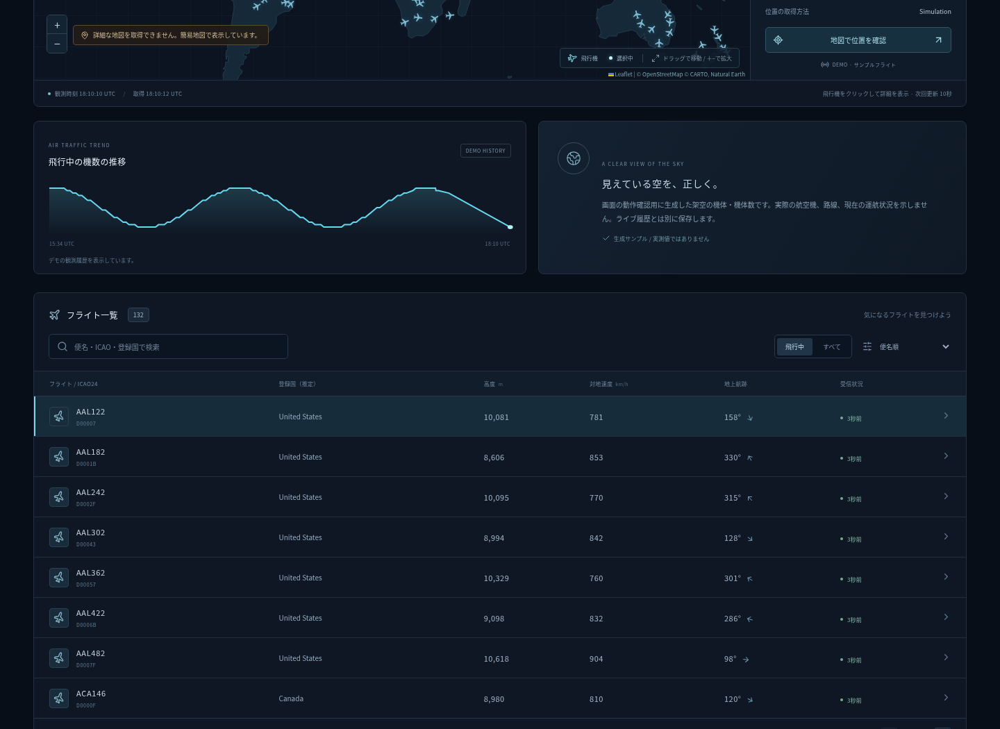
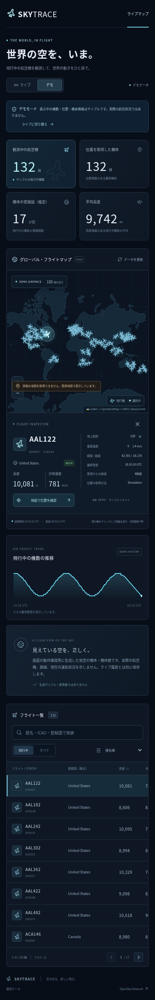

# SKYTRACE プロジェクト資料

**Global Flight Monitor / 初版 v0.1.0**

企画、実装範囲、画面、技術、データ、API、テスト、導入・運用の詳細をまとめています。アプリ本体と同じリポジトリで管理するため、そのまま GitHub に追加できます。

## 資料一覧

| 文書 | まとめている内容 |
| --- | --- |
| [01 企画書](01-project-proposal.md) | 目的、想定利用者、提供価値、初版の方針と制約 |
| [02 要件定義書](02-requirements.md) | 機能・非機能要件、範囲、受入条件、将来の機能 |
| [03 画面仕様書](03-screen-specification.md) | 画面構成、操作、表示項目、状態別の挙動 |
| [04 システム設計書](04-architecture.md) | 構成、処理フロー、キャッシュ、認証、実行方式 |
| [05 データベース設計書](05-database-design.md) | テーブル、カラム、キー、保存と履歴の制御 |
| [06 API 仕様書](06-api-specification.md) | エンドポイント、レスポンス、単位、エラー |
| [07 テスト仕様書](07-test-specification.md) | 自動テスト対応表、受入チェック、未検証項目 |
| [08 開発ロードマップ](08-roadmap.md) | 初版の成果、次の機能候補、優先順位と完了条件 |
| [09 Windows・VS Code 導入ガイド](09-windows-setup.md) | 既存フォルダーへの追加、初回準備、起動・確認 |
| [10 GitHub 追加ガイド](10-github-guide.md) | ソースと資料をまとめてコミット・送信する手順 |
| [11 運用手順書](11-operations.md) | 設定、更新間隔、DB バックアップ、障害対応 |

## 読む順番

- **起動したい場合**：[START-HERE](../START-HERE.md) → [Windows 導入](09-windows-setup.md)
- **企画を確認する場合**：企画書 → 要件定義 → 画面仕様 → ロードマップ
- **開発する場合**：要件定義 → システム設計 → DB 設計 → API 仕様 → テスト仕様
- **GitHub に追加する場合**：[GitHub ガイド](10-github-guide.md)

## 初版の画面例

以下はデモモードの画面です。機数・機体・位置は合成データで、現在の実測値を示しません。

スマートフォン表示の例（デモ）

## 文書の扱い

実装済みの説明は `src/`、`server/`、`shared/types.ts`、`tests/` と対応させています。今後の機能、目標、未検証事項は各文書で区別します。飛行中の機数は OpenSky の受信範囲の観測値であり、世界の全航空機の正確な総数ではありません。

API キーや `.env` の内容、実 DB ファイルは資料に含めません。資料の例の値は、説明用または明示したデモデータです。
